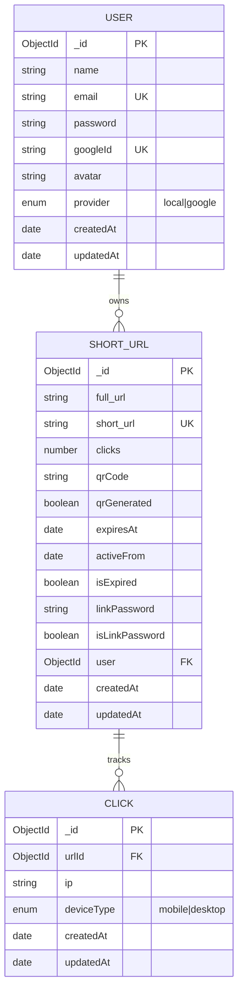
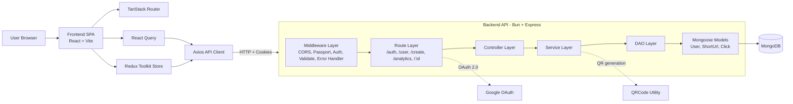

# Linkly 🔗

Linkly is a powerful, modern, and fast link shortener service built to help users efficiently shorten long URLs, track user engagement, and manage links securely. With built-in analytics and secure access control, Linkly goes beyond just shortening links—it delivers insights.

---

## 🚀 Features

### Core Functionality
- **Instant Link Shortening:** Convert very long URLs into easily shareable, compact links.
- **Custom Slugs:** Users can define their own custom aliases for shortened URLs for branding.
- **Link Expiration:** Automatically expire short links after a designated timeframe.
- **Manage Links:** Update settings on existing links or delete them completely.

### Security
- **Password Protection:** Add password protection to specific short links to prevent unauthorized access.
- **Rate Limiting & Validation:** Robust request validation on the API side using Zod, ensuring safe data processing.
- **Data Hashing:** Secure sensitive credentials utilizing Argon2.

### User Authentication
- **Local Authentication:** Sign up and log in via email and securely hashed passwords.
- **OAuth 2.0:** One-click authentication with Google OAuth integration (Passport.js).
- **JWT Tokens:** Stateless authentication mechanism via JSON Web Tokens for API requests.

### User Authorization
- **Guest Access:** Non-registered users can quickly shorten URLs (with limited features).
- **Owner Scope Control:** Users only have access to modify, view, or analyze links they own.

### Analytics Dashboard
- **Real-Time Click Tracking:** Monitor total clicks on every link in your dashboard.
- **Detailed Analytics:** Get deep insights into your short link traffic—when and how often they're clicked (visualized through an interactive chart).
- **QR Code Generation:** Generate visual QR codes to share your links physically easily.

---

## 🛠 Tech Stack

### Frontend
- **Framework:** [React 19](https://react.dev/) with [Vite](https://vitejs.dev/)
- **Language:** TypeScript
- **Styling:** [Tailwind CSS v4](https://tailwindcss.com/)
- **State Management:** [Redux Toolkit](https://redux-toolkit.js.org/)
- **Data Fetching:** [TanStack React Query](https://tanstack.com/query/latest)
- **Routing:** [TanStack React Router](https://tanstack.com/router/latest)
- **Data Visualization:** [Recharts](https://recharts.org/)
- **Icons:** [Lucide React](https://lucide.dev/)

### Backend
- **Runtime:** [Bun](https://bun.sh/) – significantly faster than Node.js!
- **Framework:** [Express.js](https://expressjs.com/)
- **Database:** [MongoDB](https://www.mongodb.com/) via [Mongoose](https://mongoosejs.com/)
- **Validation:** [Zod](https://zod.dev/)
- **Security & Crypto:** Argon2, JWT (JSON Web Tokens)
- **Authentication:** Passport.js (Google OAuth20)
- **Utilities:** Nanoid, QRCode

---

## 🗄️ Database Schema



---

## 🧩 System Architecture



---

## 📁 Project Structure
The project is divided into two primary environments:
```text
/linkly
├── backend/                   # Backend API Server (Bun / Express)
│   ├── src/
│   │   ├── config/            # DB configuration & Passport strategies
│   │   ├── controllers/       # Route handlers and core business logic
│   │   ├── dao/               # Data Access Objects for DB interaction
│   │   ├── middlewares/       # Auth guards, error handlers & Zod validation maps
│   │   ├── models/            # Mongoose schemas (User, ShortUrl, Click)
│   │   ├── routes/            # Express route declarations (auth, user, analytics)
│   │   ├── services/          # Heavy lifting and external API interactions
│   │   ├── utils/             # Helper functions (Error handling, etc.)
│   │   └── validations/       # Zod schemas definitions
│   ├── index.ts               # Entry point for backend server
│   ├── package.json
│   ├── tsconfig.json
│   ├── Dockerfile             # Backend Docker build instructions
│   └── .dockerignore
│
├── frontend/                  # React SPA Client (Vite)
│   ├── public/                # Static assets
│   ├── src/
│   │   ├── api/               # Axios instances & API utility functions
│   │   ├── components/        # Reusable UI components (Buttons, Inputs, Modals)
│   │   ├── pages/             # Route-level components (Home, Dashboard, Analytics)
│   │   ├── routing/           # TanStack Router configuration (routeTree.ts)
│   │   ├── store/             # Redux configuration
│   │   └── utils/             # Client-side helper methods
│   ├── index.html             # HTML Entry point
│   ├── vite.config.ts         # Vite bundler configuration
│   ├── package.json
│   ├── tsconfig.app.json
│   ├── Dockerfile             # Frontend Docker multi-stage build
│   ├── nginx.conf             # Custom NGINX config for SPA routing
│   └── .dockerignore
│
└── docker-compose.yml         # Container orchestration configuration
└── LICENSE                    # License file
└── README.md                  # Project README
```

---

## ⚙️ Installation and Setup

### Prerequisites
- Docker & Docker Compose (Recommended)
- [Bun](https://bun.sh/) (v1.0 or higher) - Required for local/manual setup
- [MongoDB](https://www.mongodb.com/) (Local or Atlas URI)
- Google OAuth Application Credentials (Client ID & Secret)

### 1. Clone the repository
```bash
git clone https://github.com/nirajkr26/linkly.git
cd linkly
```

### 2. Configure Environment Variables
Create a `.env` file in the `backend/` directory:
```env
PORT=3000
MONGODB_URL=your_mongodb_connection_string
JWT_SECRET=your_jwt_secret
GOOGLE_CLIENT_ID=your_google_id
GOOGLE_CLIENT_SECRET=your_google_secret
BACKEND_URL=http://localhost:3000
FRONTEND_URL=http://localhost:5173
```

*(Optional)* Create a `.env` file in `frontend/` if you need to override the API target:
```env
VITE_BACKEND_URL=http://localhost:3000
```

---

### Method A: Run with Docker Compose (Recommended)
Using Docker is the easiest way to start both the frontend and backend simultaneously.

```bash
docker-compose up -d --build
```
- The **frontend** (NGINX) will be available at: `http://localhost:5173`
- The **backend API** will be available at: `http://localhost:3000`

To stop the containers, use:
```bash
docker-compose down
```

---

### Method B: Run Standalone Docker Containers
If you wish to build and run only a single container, you can do so manually:

**To run only the Backend:**
```bash
cd backend
docker build -t linkly-backend .
docker run -p 3000:3000 --env-file .env linkly-backend
```

**To run only the Frontend:**
```bash
cd frontend
docker build --build-arg VITE_BACKEND_URL=http://localhost:3000 -t linkly-frontend .
docker run -p 5173:80 linkly-frontend
```

---

### Method C: Manual Local Setup

#### Backend Setup
```bash
cd backend
bun install
bun run dev
```

#### Frontend Setup
```bash
cd frontend
bun install
bun run dev
```

---

## 📡 API Endpoints

### Authentication
- `POST /api/auth/signup` – Register a new account
- `POST /api/auth/login` – Login with email & password
- `POST /api/auth/logout` – Logout and clear credentials
- `GET  /api/auth/me` – Retrieve the current logged-in user details
- `GET  /api/auth/google` – Initialize Google OAuth Flow

### URLs
- `POST /api/urls/` – Create a new short URL (Custom Slug, Password, Expiration optional)
- `POST /api/urls/verify` – Verify password for a protected URL
- `GET  /api/user/urls` – Fetch all URLs generated by the authenticated user
- `PUT  /api/user/urls/:id` – Modify an specific URL (update password, expiration, etc.)
- `DELETE /api/user/urls/:id` – Remove a short URL

### Analytics
- `GET /api/analytics/:slug` – Fetch detailed statistics and click data for a specific link

---

## 📖 Usage

1. **Shorten a Link:** Simply visit the homepage, paste your extremely long URL, and hit "Shorten".
2. **Access Dashboard:** Log in to your account. Go to your dashboard to view all previously shortened links.
3. **Customize your Links:** While logged in, you can set a memorable custom alias (slug) as opposed to a random character string.
4. **Export to QR Code:** Instead of sending a link, generate a QR code for your URL and easily share it offline or in presentations.
5. **View Analytics:** Click the "Analytics" tab inside the dashboard to view chart-based data representing clicks over time, geographic data, or referrers.

---

## 🤝 Contribution

Contributions are what make the open-source community such an amazing place to learn, inspire, and create. Any contributions you make are **greatly appreciated**.

1. Fork the Project
2. Create your Feature Branch (`git checkout -b feature/AmazingFeature`)
3. Commit your Changes (`git commit -m 'Add some AmazingFeature'`)
4. Push to the Branch (`git push origin feature/AmazingFeature`)
5. Open a Pull Request

---

## 📄 License

Distributed under the MIT License. See `LICENSE` for more information.

---

## 👨‍💻 Author

**Niraj Kumar** (nirajkr26)
- GitHub: [github.com/nirajkr26](https://github.com/nirajkr26)
- LinkedIn: [linkedin.com/in/nirajkr26](https://www.linkedin.com/in/nirajkr26/)
